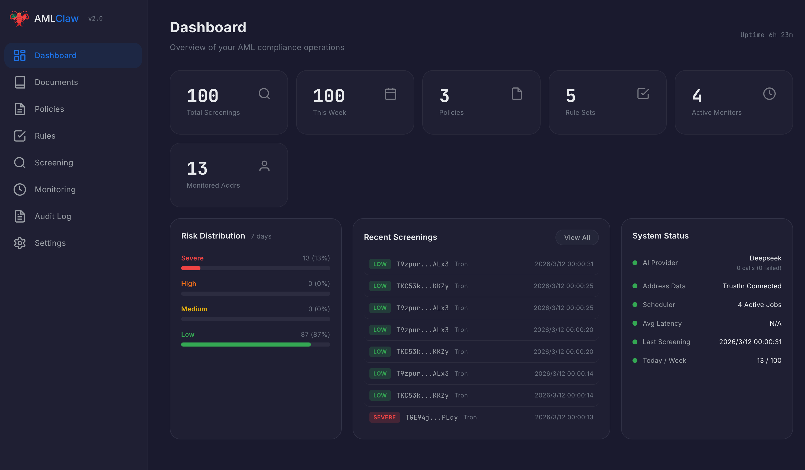
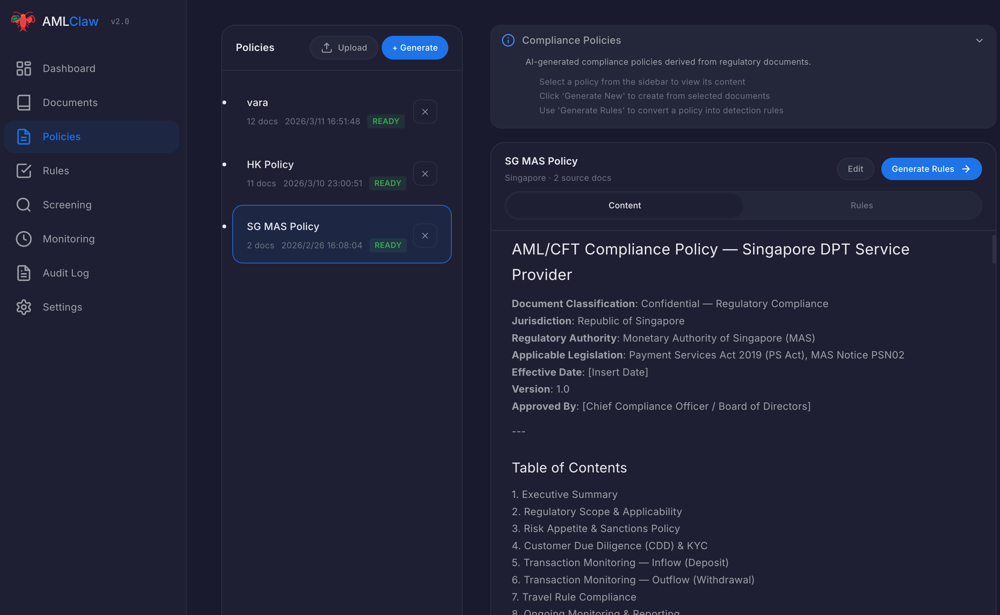

<!-- Badges -->
[](LICENSE)
[](CHANGELOG.md)
[](https://github.com/amlclaw/amlclaw-web/actions)
[](https://nodejs.org)
[](https://nextjs.org)
[](https://www.typescriptlang.org)

# AMLClaw Web

> 🛡️ Open-source, self-hosted, AI-driven crypto AML compliance platform.

**Regulations in, compliance out — five-step automated pipeline powered by AI.**

Documents → Policies → Rules → Screening → Monitoring

---

## Table of Contents

- [Why AMLClaw?](#why-amlclaw)
- [What It Does](#what-it-does)
- [Screenshots](#screenshots)
- [Quick Start](#quick-start)
- [Features](#features)
- [Supported AI Providers](#supported-ai-providers)
- [Built-in Rulesets & Scenarios](#built-in-rulesets--scenarios)
- [Configuration](#configuration)
- [Project Structure](#project-structure)
- [Development](#development)
- [Docker Deployment](#docker-deployment)
- [Translation / i18n](#translation--i18n)
- [Roadmap](#roadmap)
- [Contributing](#contributing)
- [License](#license)

---

## Why AMLClaw?

Crypto AML compliance is broken. A new regulation drops — lawyers spend 2 weeks interpreting it, compliance experts spend a week writing rules, engineers spend another week shipping. Screening a single address? Half a day of manual work. Repeat next month.

**AMLClaw replaces that entire cycle with AI.**

| | Traditional | AMLClaw |
|---|---------|---------|
| **Understand regulations** | Lawyers + experts, 1–2 weeks | AI reads & generates policy in minutes |
| **Write detection rules** | Manual, days of work | AI auto-generates, visual editor to fine-tune |
| **Screen an address** | Manual, half a day | One click, report in < 5 min |
| **Continuous monitoring** | Manual spot-checks | 7×24 automated scheduling |
| **Audit trail** | Dig through emails | Full audit log, one-click export |

The end game of compliance isn't more people — it's a better system.

---

## What It Does

```
  Documents        Policies          Rules           Screening        Monitoring
 ───────────     ───────────     ───────────      ───────────      ───────────
│  40+ intl  │   │  AI reads  │   │ AI converts│   │ On-chain  │   │  Cron     │
│ regulations│ → │ & generates│ → │ to JSON    │ → │ tracing + │ → │ scheduler │
│ + uploads  │   │  policies  │   │  rules     │   │ risk match│   │ 7×24 auto │
 ───────────     ───────────     ───────────      ───────────      ───────────
     ①               ②               ③               ④               ⑤
```

1. **Documents** — Curated library of 40+ international AML regulations (FATF, MAS, SFC, VARA) plus custom uploads
2. **Policies** — AI reads regulatory docs and generates structured compliance policies (streaming)
3. **Rules** — AI converts policies into machine-readable detection rules (JSON) with visual editor
4. **Screening** — On-chain address screening via TrustIn KYA API, cross-referenced against your rules
5. **Monitoring** — Scheduled recurring screening with cron-based task scheduler & webhook alerts

Every step can run fully automated or with human-in-the-loop. Every action is audit-logged.

---

## Screenshots

> 📸 *Screenshots coming soon. See [`public/screenshots/README.md`](public/screenshots/README.md) for contribution specs.*

<!-- Uncomment as screenshots are added:

### Dashboard

*Real-time overview: total screenings, risk distribution, active monitors, system health.*

### Screening Result

*On-chain evidence graph with risk paths, matched rules, and one-click PDF/Markdown export.*

### Visual Rule Editor

*AI-generated detection rules with drag-and-drop threshold editing — no code required.*

### AI Policy Generation

*Streaming AI output turning regulatory documents into structured compliance policies.*

### Monitoring Tasks

*Cron-scheduled tasks with execution history, webhook alerts on high-risk findings.*

-->

---

## Quick Start

```bash
git clone https://github.com/amlclaw/amlclaw-web.git
cd amlclaw-web
npm install
npm run dev
```

Open `http://localhost:3000` and go to **Settings** to configure your API keys.

### Required API Keys

| Key | What For | Where to Get |
|-----|----------|--------------|
| **AI Provider** (Claude / DeepSeek / Gemini) | Policy & rule generation | [Anthropic](https://console.anthropic.com) / [DeepSeek](https://platform.deepseek.com) / [Google AI](https://aistudio.google.com) |
| **TrustIn API Key** | Blockchain address screening | [trustin.info](https://trustin.info) (free tier: 100 req/day) |

All keys are configured through the in-app Settings page — no `.env` file editing required.

---

## Features

### ✨ Core Highlights

- 🤖 **Multi-AI** — Claude, DeepSeek, Gemini — switch anytime, no vendor lock-in
- 📋 **40+ regulations** built-in (FATF, MAS, SFC, VARA) across 3 jurisdictions
- 🔍 **On-chain screening** via TrustIn KYA API with evidence graph (1–5 hops, up to 1000 nodes)
- 📊 **Continuous monitoring** with cron scheduler & webhook alerts (Slack, Teams, PagerDuty)
- 🌍 **Bilingual** (English / 中文) with dark/light theme
- 🐳 **Docker ready** — one command to deploy
- 📁 **No database** — file-based storage, backup-friendly, deploy anywhere

### 🏢 Enterprise-Grade

- **API authentication** — Bearer token protection on all endpoints
- **Audit logging** — Append-only JSONL, tamper-resistant, full operation trail
- **Webhook integration** — Real-time alerts for high-risk events
- **Batch screening** — Up to 100 addresses per submission
- **Report export** — Markdown & PDF with custom branding
- **Self-hosted** — Data never leaves your server

---

## Supported AI Providers

| Provider | SDK | Models |
|----------|-----|--------|
| **Claude** (Anthropic) | `@anthropic-ai/sdk` | claude-sonnet-4-6, claude-opus-4-6, claude-haiku-4-5 |
| **DeepSeek** | OpenAI-compatible | deepseek-chat, deepseek-reasoner |
| **Gemini** (Google) | `@google/genai` | gemini-2.0-flash, gemini-2.5-pro, gemini-2.5-flash |

Switch providers anytime from Settings. All AI features work with any provider.

---

## Built-in Rulesets & Scenarios

### Rulesets

| Ruleset | Jurisdiction | Regulations |
|---------|-------------|-------------|
| Singapore MAS DPT | Singapore | MAS Notice PSN02, DPT licensing |
| Hong Kong SFC VASP | Hong Kong | SFC VASP licensing requirements |
| Dubai VARA | Dubai / UAE | VARA Rulebook enforcement |

### Screening Scenarios

| Scenario | Rule Categories | Direction | Use Case |
|----------|----------------|-----------|----------|
| `deposit` | Deposit | all | Fund source analysis |
| `withdrawal` | Withdrawal | outflow | Destination risk check |
| `cdd` | CDD | all | Transaction threshold triggers |
| `monitoring` | Ongoing Monitoring | all | Structuring/smurfing alerts |
| `all` | ALL | all | Full comprehensive scan |

---

## Configuration

All settings are managed through the **Settings** page (`/settings`):

- **AI Provider** — Select active provider, configure API keys and models
- **Blockchain** — TrustIn API key and base URL
- **Screening Defaults** — Inflow/outflow hops, max nodes, default scenario and ruleset
- **Monitoring** — Max addresses per task, default schedule
- **Notifications** — Webhook URL for high-risk alerts (Slack, Teams, PagerDuty)
- **Security** — API token (Bearer auth for all endpoints)
- **Application** — Branding (app name, report header), default theme

Settings are stored at `data/settings.json`. For legacy compatibility, `TRUSTIN_API_KEY` in `.env.local` is also supported as fallback.

---

## Project Structure

```
app/
  (app)/           # Product pages (dashboard, documents, policies, rules, screening,
                   #   monitoring, audit, docs, settings)
  api/             # API routes
  page.tsx         # Landing page
  globals.css      # Core design system (~1400 lines)
components/        # React components
  landing/         # Landing page sections (11 files)
lib/
  ai.ts            # Multi-provider AI engine (streaming)
  ai-providers/    # Claude, DeepSeek, Gemini adapters
  settings.ts      # User settings (data/settings.json)
  storage.ts       # File-based CRUD
  auth.ts          # Bearer token API authentication
  i18n.ts          # en/zh translation dictionary
  trustin-api.ts   # TrustIn KYA v2 wrapper
  scheduler.ts     # Cron-based monitoring scheduler
  extract-risk-paths.ts  # Scenario-based rule matching engine
  audit-log.ts     # Append-only JSONL audit log
  webhook.ts       # HTTP POST webhook notifications
  export-md.ts     # Markdown report export
  export-pdf.ts    # PDF report export (zero dependencies)
data/
  defaults/        # Built-in rulesets (Singapore MAS, Hong Kong SFC, Dubai VARA)
  schema/          # JSON schemas
references/        # Regulatory source documents (40+ files)
prompts/           # AI prompt templates
public/
  screenshots/     # App screenshots (see screenshots/README.md for specs)
tests/
  unit/            # Vitest unit tests
  integration.test.mjs  # Integration tests
```

---

## Development

```bash
npm run dev          # Dev server on port 3000
npm run build        # Production build
npm run lint         # ESLint
npm run test:unit    # Unit tests (vitest)
npm test             # Integration tests (requires dev server running)
```

---

## Docker Deployment

### Quick Start with Docker

```bash
docker compose up -d
```

Open http://localhost:3000 and configure API keys in **Settings**.

### Build from Source

```bash
docker compose up -d --build
```

### Environment Variables

You can pass environment variables instead of using the Settings UI:

```yaml
environment:
  - TRUSTIN_API_KEY=your_key_here
```

Data is persisted in the `./data` directory via volume mount.

### Production Tips

- Mount `./data` to a persistent volume for data durability
- Use a reverse proxy (nginx/Caddy) for HTTPS
- Set `security.apiToken` in Settings for API authentication

---

## Translation / i18n

AMLClaw supports English and Chinese out of the box. Translation files live in [`locales/`](locales/):

```
locales/en.json   # English (default)
locales/zh.json   # 中文
```

Want to add a new language? See [`locales/README.md`](locales/README.md) for the full guide.

---

## Roadmap

- 🔗 **More chains** — Solana, Polygon, BSC, Arbitrum support
- 🇪🇺 **MiCA compliance** — EU Markets in Crypto-Assets regulation rulesets
- 🇺🇸 **US FinCEN** — BSA/AML rules for US-based entities
- 🌐 **SaaS version** — Managed cloud offering with team collaboration
- 📊 **Analytics dashboard** — Trend analysis, risk heatmaps, compliance KPIs
- 🔌 **Plugin system** — Custom data sources and screening providers
- 🤝 **Case management** — SAR filing workflow and investigation tools

---

## 📖 Documentation

Full documentation is available in the [`docs/`](docs/) directory:

- **[Getting Started](docs/getting-started.md)** — Clone, install, configure, and run
- **User Guide:** [Documents](docs/user-guide/documents.md) · [Policies](docs/user-guide/policies.md) · [Rules](docs/user-guide/rules.md) · [Screening](docs/user-guide/screening.md) · [Monitoring](docs/user-guide/monitoring.md) · [Audit Log](docs/user-guide/audit-log.md) · [Settings](docs/user-guide/settings.md)
- **API:** [Overview](docs/api/overview.md) · [Endpoints](docs/api/endpoints.md)
- **Deployment:** [Docker](docs/deployment/docker.md) · [Manual](docs/deployment/manual.md) · [Configuration](docs/deployment/configuration.md)
- **Development:** [Architecture](docs/development/architecture.md) · [Writing Rules](docs/development/writing-rules.md)

## Contributing

See [CONTRIBUTING.md](CONTRIBUTING.md) for development setup, code standards, and PR process.

---

## License

[MIT](LICENSE)
