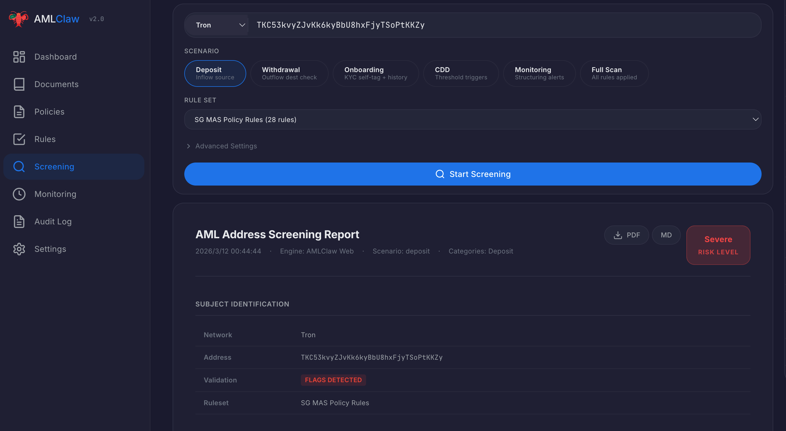
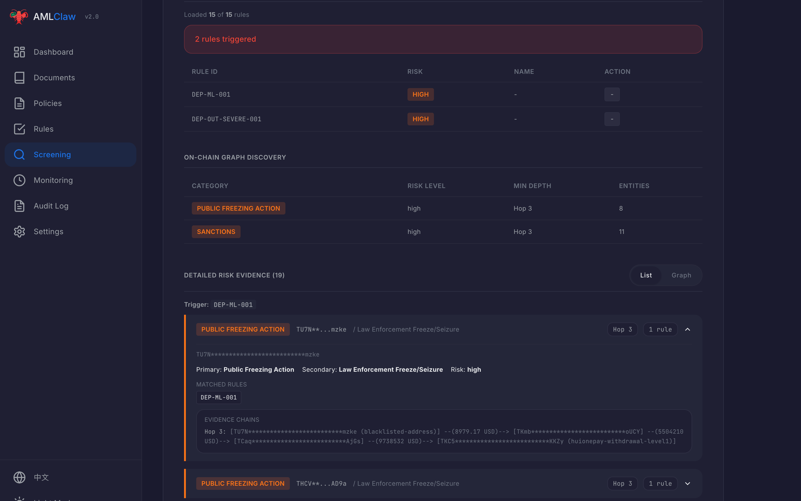
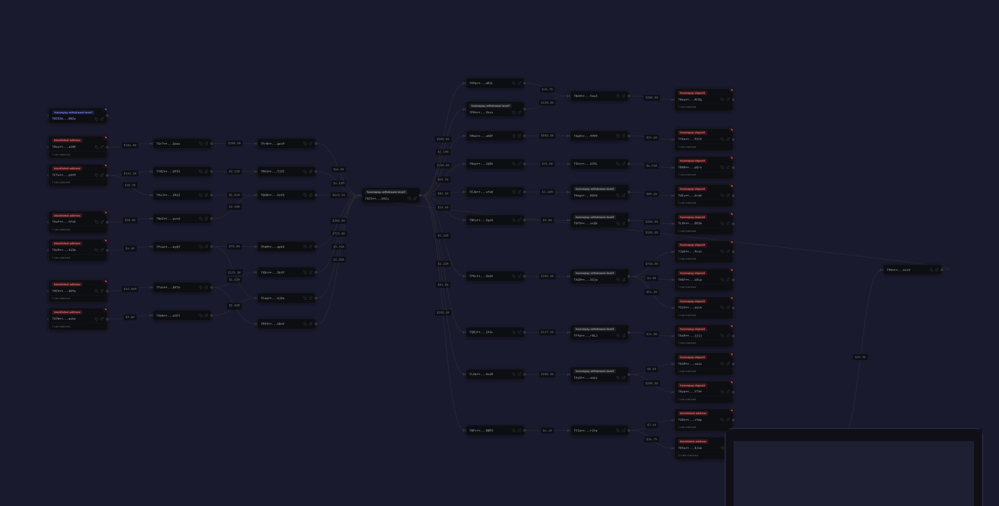
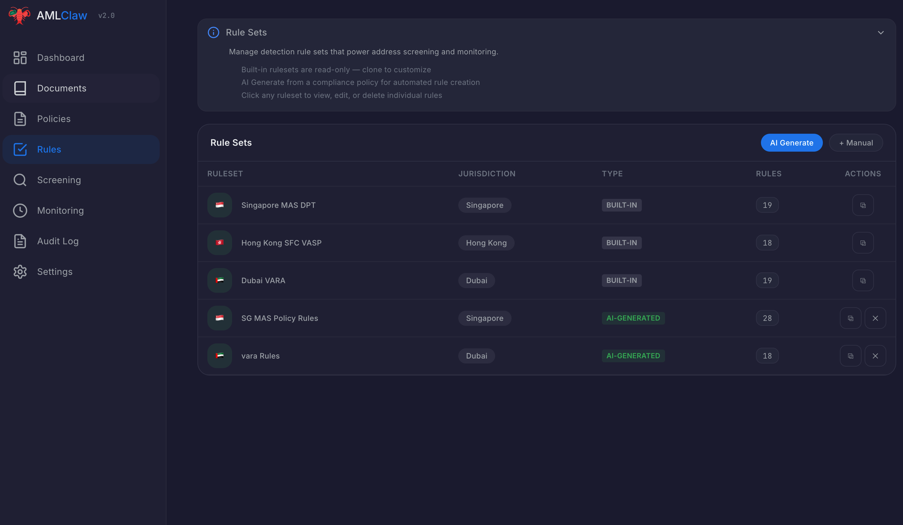
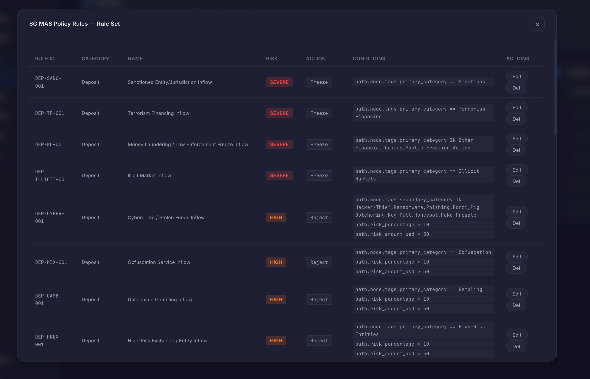
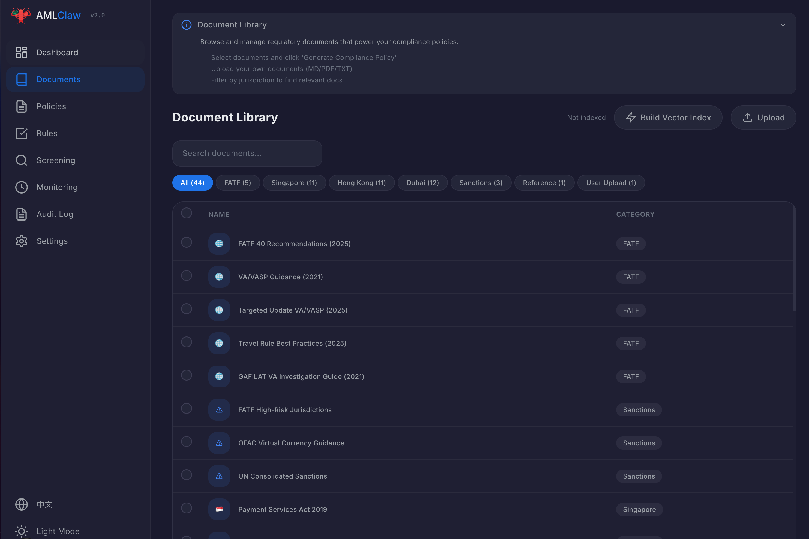

<!-- Badges -->
[](LICENSE)
[](CHANGELOG.md)
[](https://github.com/amlclaw/amlclaw.com/actions)
[](https://nodejs.org)
[](https://nextjs.org)
[](https://www.typescriptlang.org)

# AMLClaw

> Your AI Compliance Team — zero-config, open-source crypto AML platform powered by Claude Code.

**Regulations in, compliance out. No API keys, no setup, no vendor lock-in.**

```
Documents → Policies → Rules → Screening → Monitoring
```

---

## Zero Config — Just Run It

```bash
git clone https://github.com/amlclaw/amlclaw.com.git
cd amlclaw.com
npm install
npm run dev
```

That's it. Open `http://localhost:3000` and start using.

### Prerequisites

- **Node.js 18+**
- **Claude Code CLI** — installed and logged in

```bash
# Install Claude Code (if you haven't)
npm install -g @anthropic-ai/claude-code

# Login (one-time)
claude login
```

AMLClaw uses your local Claude Code session directly — no API keys to configure, no tokens to paste. Your Claude Pro/Max subscription powers all AI features.

> **TrustIn API Key** (optional): For blockchain address screening. Get a free key at [trustin.info](https://trustin.info) (100 req/day). Without it, screening works in desensitized mode.

---

## Why AMLClaw?

Crypto AML compliance is broken. A new regulation drops — lawyers spend 2 weeks interpreting it, compliance experts spend a week writing rules, engineers spend another week shipping. Screening a single address? Half a day of manual work. Repeat next month.

**AMLClaw replaces that entire cycle with AI.**

| | Traditional | AMLClaw |
|---|---------|---------|
| **Understand regulations** | Lawyers + experts, 1-2 weeks | AI reads & generates policy in minutes |
| **Write detection rules** | Manual, days of work | AI auto-generates, visual editor to fine-tune |
| **Screen an address** | Manual, half a day | One click, report in < 5 min |
| **Continuous monitoring** | Manual spot-checks | 7x24 automated scheduling |
| **Audit trail** | Dig through emails | Full audit log, one-click export |

---

## What It Does

```
  Documents        Policies          Rules           Screening        Monitoring
 -----------     -----------     -----------      -----------      -----------
|  40+ intl  |   |  AI reads  |   | AI converts|   | On-chain  |   |  Cron     |
| regulations| > | & generates| > | to JSON    | > | tracing + | > | scheduler |
| + uploads  |   |  policies  |   |  rules     |   | risk match|   | 7x24 auto |
 -----------     -----------     -----------      -----------      -----------
     1               2               3               4               5
```

1. **Documents** — 40+ international AML regulations (FATF, MAS, SFC, VARA) plus custom uploads
2. **Policies** — AI reads regulatory docs and generates compliance policies. Add custom instructions to tailor output.
3. **Rules** — AI converts policies into machine-readable detection rules (JSON) with visual editor
4. **Screening** — On-chain address screening via TrustIn KYA API, cross-referenced against your rules
5. **Monitoring** — Scheduled recurring screening with cron scheduler & webhook alerts

Every step runs fully automated or with human-in-the-loop. Every action is audit-logged.

---

## Screenshots

### Dashboard


### Address Screening



### On-Chain Graph


### AI-Generated Rules



### Compliance Policies


### Document Library


---

## Features

### Core

- **Zero-config AI** — Uses your local Claude Code installation directly, no API keys needed
- **Custom Instructions** — Guide AI output when generating policies and rules
- **40+ regulations** built-in (FATF, MAS, SFC, VARA) across 3 jurisdictions
- **On-chain screening** via TrustIn KYA API with evidence graph (1-5 hops, up to 1000 nodes)
- **Continuous monitoring** with cron scheduler & webhook alerts
- **Bilingual** (English / Chinese) with dark/light theme
- **No database** — file-based storage, backup-friendly, deploy anywhere

### Enterprise-Grade

- **API authentication** — Bearer token protection on all endpoints
- **Audit logging** — Append-only JSONL, tamper-resistant, full operation trail
- **Webhook integration** — Real-time alerts for high-risk events
- **Batch screening** — Up to 100 addresses per submission
- **Report export** — Markdown & PDF with custom branding
- **SAR generation** — AI-generated Suspicious Activity Reports (Singapore, Hong Kong, Dubai)
- **Self-hosted** — Data never leaves your server

---

## AI Engine

AMLClaw uses **Claude Code** as its AI engine with two modes:

| Mode | Auth | When Used |
|------|------|-----------|
| **CLI** (default) | Your local `claude login` session | Zero config — just works |
| **SDK** (advanced) | OAuth token in Settings | When you need MCP tools, budget control |

**CLI mode** is the default. It spawns `claude -p` as a subprocess and inherits your existing Claude Code login. No configuration needed.

**SDK mode** activates when you paste an OAuth token in Settings. This enables Agent SDK features like MCP tool calling for the Copilot, budget caps, and turn limits.

---

## Built-in Rulesets & Scenarios

3 jurisdictions (Singapore MAS, Hong Kong SFC, Dubai VARA) x 5 screening scenarios:

| Scenario | What It Checks |
|----------|---------------|
| **Deposit** | Inflow source risk + address self-tags |
| **Withdrawal** | Outflow destination risk |
| **CDD** | Transaction threshold triggers |
| **Monitoring** | Structuring/smurfing patterns |
| **Full Scan** | All rules, all directions |

---

## Project Structure

```
app/(app)/        # Product pages (dashboard, documents, policies, rules, screening, ...)
app/api/          # API routes
components/       # React components by domain
lib/              # Core logic (ai-agent.ts, storage.ts, settings.ts, scheduler.ts, ...)
data/             # Runtime data + built-in rulesets (file-based, no database)
references/       # 40+ regulatory source documents
prompts/          # AI prompt templates
tests/            # Unit (vitest) + integration tests
```

---

## Development

```bash
npm run dev          # Dev server on port 3000
npm run build        # Production build
npm run lint         # ESLint
npm run test:unit    # Unit tests (vitest)
npm test             # Integration tests (requires dev server running)
```

---

## Docker Deployment

```bash
docker compose up -d
```

Open http://localhost:3000. Claude Code CLI must be available in the container.

Data is persisted in the `./data` directory via volume mount.

### Production Tips

- Mount `./data` to a persistent volume for data durability
- Use a reverse proxy (nginx/Caddy) for HTTPS
- Set `security.apiToken` in Settings for API authentication

---

## Translation / i18n

English and Chinese out of the box. Translation files in [`locales/`](locales/):

```
locales/en.json   # English (default)
locales/zh.json   # Chinese
```

---

## Roadmap

- **More chains** — Solana, Polygon, BSC, Arbitrum
- **MiCA compliance** — EU Markets in Crypto-Assets regulation
- **US FinCEN** — BSA/AML rules for US-based entities
- **Analytics** — Trend analysis, risk heatmaps, compliance KPIs
- **Case management** — SAR filing workflow and investigation tools

---

## Contributing

See [CONTRIBUTING.md](CONTRIBUTING.md) for development setup and PR process.

## Security

See [SECURITY.md](SECURITY.md). AMLClaw is self-hosted by design — your data never leaves your server.

## License

[MIT](LICENSE)
